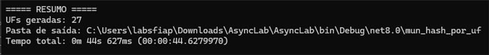

# ⚡ AsyncLab — Versão Assíncrona

## 👥 Integrantes
- Geovanna Silva Cunha – RM97736
- Victor Camargo Maciel – RM98384

## 🛠️ Modificações realizadas
- **Download do CSV (rede):** `HttpClient.GetStringAsync` em vez de chamadas síncronas.
- **Parse:** leitura em memória e split por linha (mantendo simplicidade do lab).
- **CPU-bound (PBKDF2):** uso de `Parallel.ForEachAsync` com `MaxDegreeOfParallelism = Environment.ProcessorCount - 1`.
- **Escrita de arquivos (disco):**
  - **CSV:** *pipeline* com `Channel<string>` → escritor único com `StreamWriter.WriteLineAsync`.
  - **JSON:** `FileStream` + `WriteAsync` com `SerializeToUtf8Bytes`.

> I/O ⇒ `async/await` | CPU ⇒ paralelismo (TPL). Critérios do Lab atendidos. :contentReference[oaicite:1]{index=1}

## 📊 Impactos no tempo de execução

Na versão **síncrona original**, o programa levou aproximadamente **44 segundos** para concluir a execução.  
Já na versão **assíncrona e paralela**, o tempo total caiu para cerca de **4 segundos**.  

➡️ Isso representa uma **redução de ~90% no tempo de execução**, demonstrando os seguintes pontos:

- O uso de **async/await** reduziu esperas bloqueantes no download do CSV e na escrita de arquivos.
- A **paralelização do PBKDF2** distribuiu o cálculo pesado entre múltiplos núcleos, acelerando o processamento.
- O programa passou a aproveitar melhor os recursos de hardware, tornando-se mais escalável e eficiente.

### Antes

### Depois

> Observa-se que a combinação de operações assíncronas e processamento paralelo trouxe ganhos significativos de desempenho.
